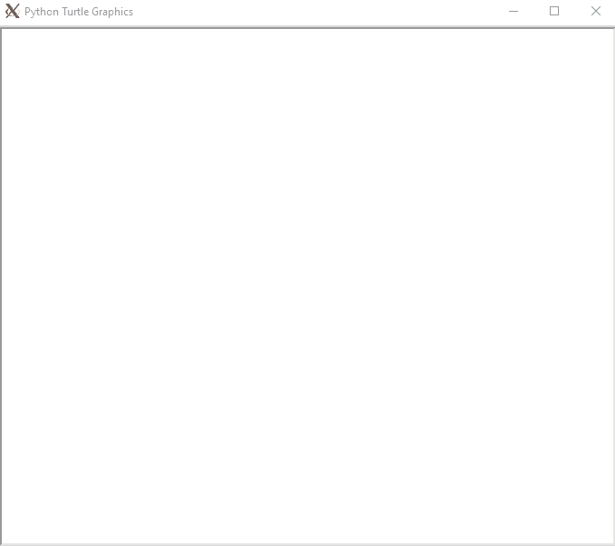

# README

Welcome. This is the 0x0C-python-almost_a_circle directory where I'm storing an exercise of class creation, inheritance, serialization and deserialization and unit testing.

## File descriptions

 - ``models``: All the classes and its methods of the current project.
    - ``base.py``: The base class. It contains a counter of objects created, serialization and deserialization methods from and to json and csv, and a creation method given a dictionary as a keyword argument.
    - ``rectangle.py``: A rectangle class inherited from the base class. It has as attributes its width, height and x and y offsets for displaying on screen and as methods, area, display, update and to_dictionary.
    - ``square.py``: A square class inherited from the rectangle class. It has as attributes its size, and x and y offsets for displaying on screen and as methods, update and to_dictionary.
 - ``tests/test_models``: The diverse tests used with the ``unittest`` python module.
 - ``main_files/101-main``: A sample file with some rectangles and squares created to be drawn with the turtle module.

## Running the sample ``101-main`` file

To run the ``101-main.py`` sample file, use the command:

```bash
python3 -m main_files.101-main
```

Be aware that you need to have X11 support in your system, or enable X11 forwarding in your terminal.

To do that, [read this article if you're using Vagrant.](https://code-maven.com/xforwarding-from-vagrant-box)

If everything's correct, it will display the following window. Note that first the rectangles are drawn and then the squares. This is done for organization sake.

